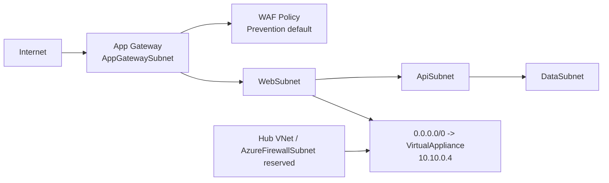

# production-cloud-network-platform

Synthetic Azure networking reference built for portfolio review and offline Terraform validation. This repository models a hub-and-spoke platform foundation with Application Gateway + WAF ingress, tiered application segmentation, and an explicit 0.0.0.0/0 VirtualAppliance egress path without deploying any live Azure resources.

## Architecture snapshot

## What this demonstrates

- Application Gateway + WAF ingress using Azure Application Gateway v2 and WAF_v2
- Application tier segmentation: Web, API, and Data with explicit trust boundaries
- Default egress intent via 0.0.0.0/0 -> VirtualAppliance while keeping the firewall/NVA resource synthetic
- Backend HTTPS trust modelling with a deterministic synthetic root certificate and SNI-aligned probe config
- Application Gateway diagnostics are modelled to send access/WAF logs and metrics to a synthetic Log Analytics workspace resource ID; no real telemetry has been collected
- Offline Terraform validation through mock_provider and empty Azure config isolation

## Security model

- App Gateway sits in its own AppGatewaySubnet and is separated from the workload subnets.
- WAF is attached to the gateway and defaults to Prevention, with Detection supported for validation.
- Web -> API is limited to HTTPS on 443; API -> Data is limited to PostgreSQL on 5432.
- Each tier keeps a final module-owned DenyAllInbound rule at priority 4096.
- East-west firewall inspection is represented as a planned path, not a live resource deployment.

## Validation and testing

- `terraform fmt`
- `terraform init -backend=false`
- `terraform validate`
- `terraform test`
- All execution remains offline using `mock_provider` and empty `AZURE_CONFIG_DIR` with no ARM_* values or Azure CLI auth.

## Current vs planned / simulated

| Status | Scope |
| --- | --- |
| Current | Hub-and-spoke network, App Gateway ingress, WAF policy, route model, synthetic east-west routing intent |
| Planned / simulated | Azure Firewall/NVA resource, live inspection path, real telemetry, production-grade tuning |

## Limitations

This repository is intentionally synthetic and non-deploying; it is designed for architecture review, Terraform validation, and portfolio presentation rather than production operations.

## Roadmap

See [docs/roadmap.md](docs/roadmap.md) and [docs/architecture.md](docs/architecture.md) for the implemented and intentionally planned scope.
